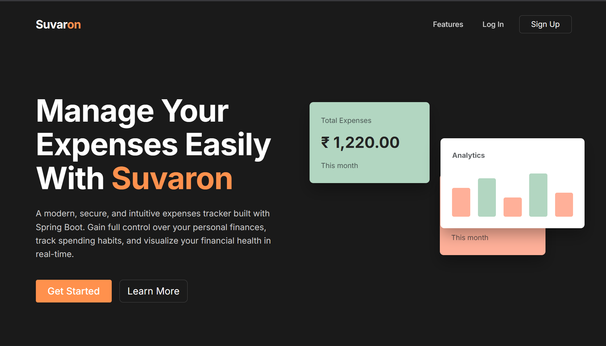
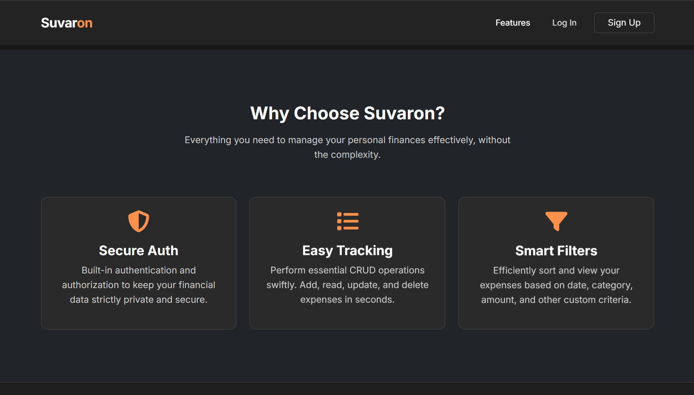
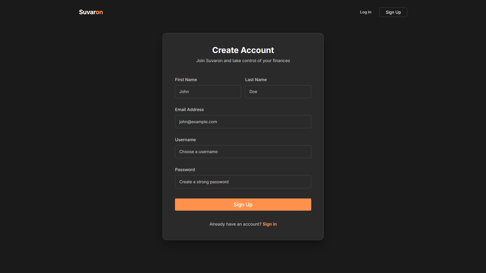
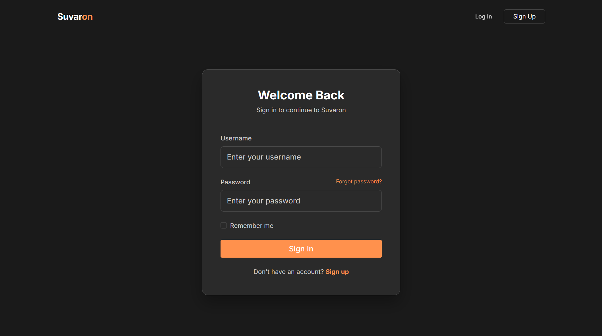
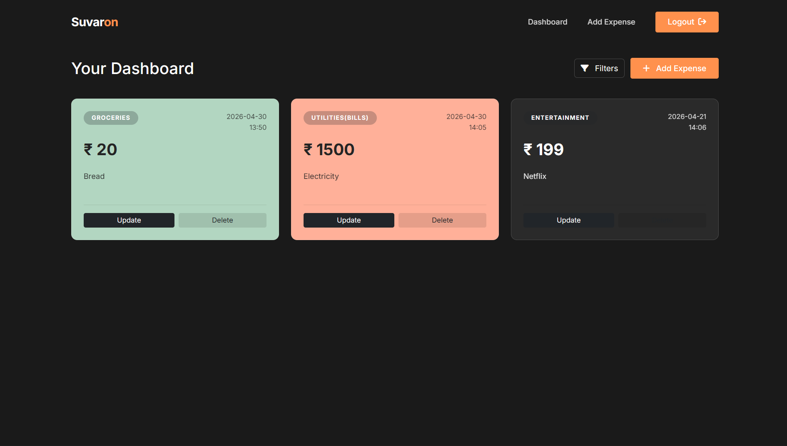
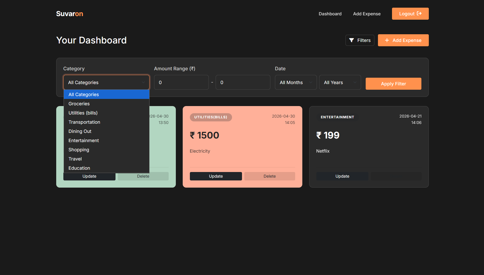
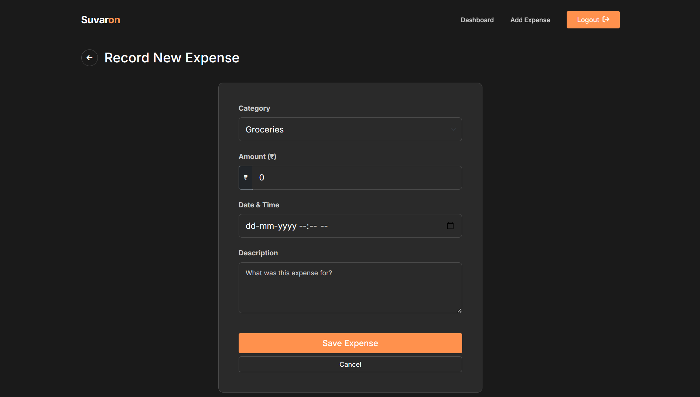
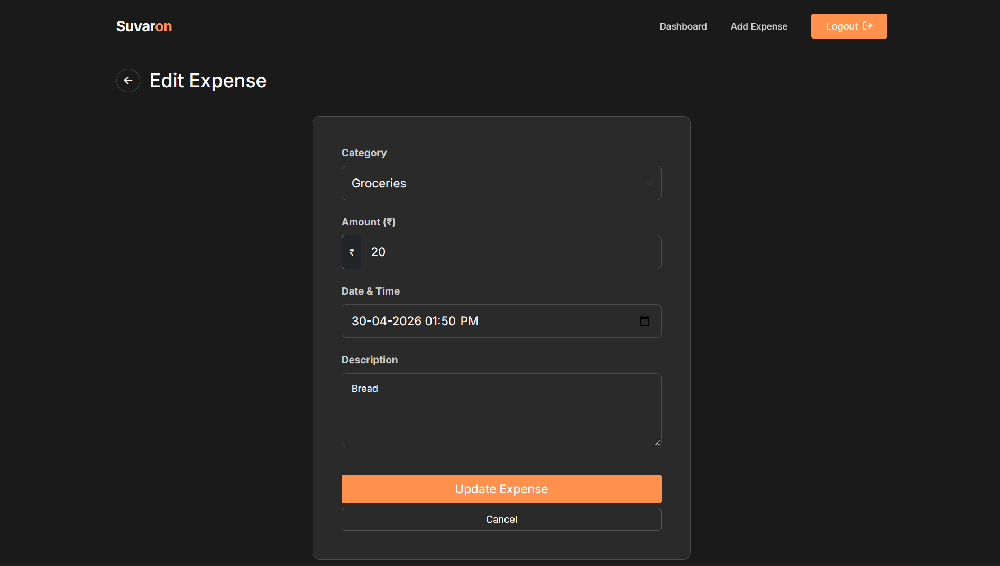

# SUVARON
### *Take Control of Your Personal Finances*

---

## 💡 About The Project

**Suvaron** is a full-stack expense tracking web application engineered to simplify financial management. It provides secure user management, real-time data analysis, and intuitive expense tracking in one unified dashboard.

### ✨ Key Features
* 🔒 **Role-Based Security:** Authentication & authorization powered by Spring Security.
* 📝 **Full Expense CRUD:** Add, view, edit, and delete expense entries easily.
* 🔍 **Smart Filtering:** Slice and analyze your spending data with fast query filters.
* 📱 **Responsive UI:** Clean, modern interface built with Bootstrap and Thymeleaf.

---

## Features
- **User Authentication and Authorization:** Securely sign up, sign in, and access the app with built-in authentication and authorization.
- **CRUD Operations:** Perform essential financial tracking actions such as adding, reading, updating, and deleting expenses.
- **Filtering:** Utilize the filtering feature to efficiently sort and view expenses based on various criteria.

---

## ScreenShots
  
  
  
  
  
  
  
  

---

## 🛠️ Tech Stack & Architecture

| Layer | Technology |
| :--- | :--- |
| **Language** | Java |
| **Core Framework** | Spring Boot |
| **Web / MVC** | Spring MVC |
| **Security** | Spring Security |
| **Persistence** | Spring Data JPA + MySQL |
| **Frontend** | Thymeleaf, Bootstrap |

---

## Getting Started
1. **Clone the Repository:**
`git clone link`

2. **Configure Database:**
Set up MySQL database and update the application.properties file with your database configuration.

3. **Build and Run:**
Build the project using your preferred IDE or with Maven:
`mvn clean install`.

4. **Run the application:**
`java -jar target/expenses-tracker.jar`.

5. **Access the App:**
Open your web browser and navigate to `http://localhost:8080`.

